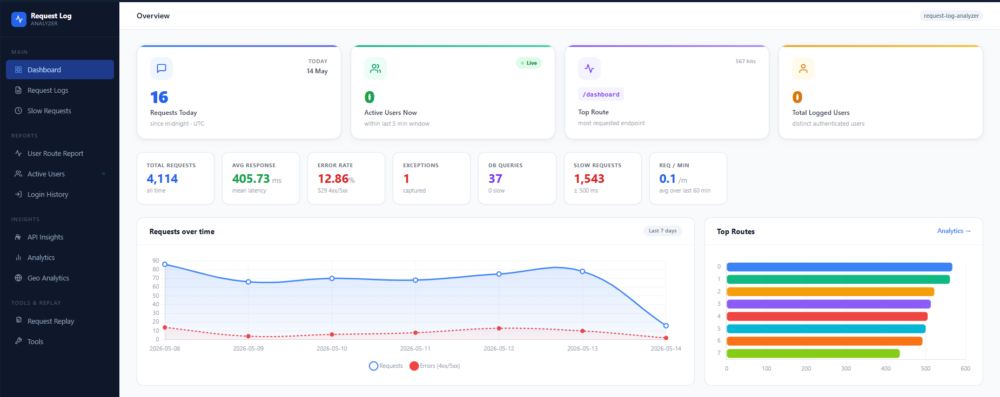
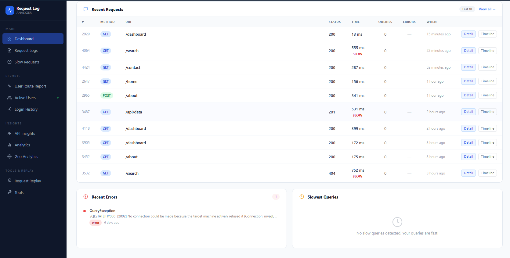
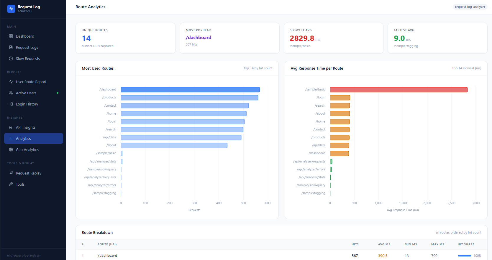
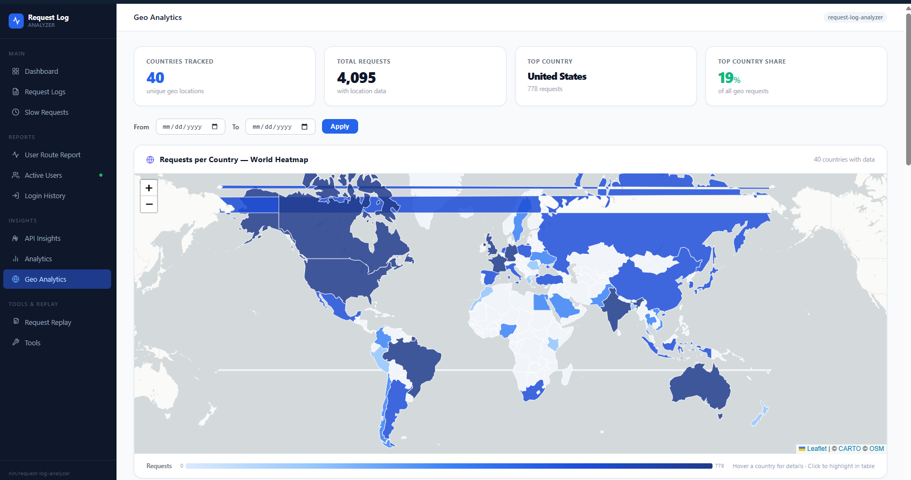
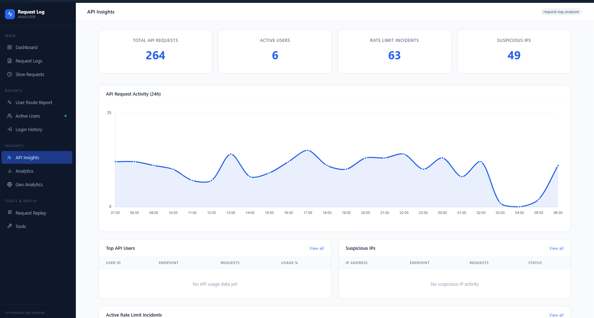

# Request Log Analyzer for Laravel

Monitor, analyze, and debug HTTP requests, database queries, errors, and performance metrics with an interactive dashboard.

[]()
[]()
[]()
[]()

---

## Table of Contents

1. [Requirements](#1-requirements)
2. [Installation](#2-installation)
3. [Register Middleware](#3-register-middleware)
4. [Verify Installation](#4-verify-installation)
5. [Dashboard & Pages](#5-dashboard--pages)
6. [Configuration Reference](#6-configuration-reference)
7. [Artisan Commands](#7-artisan-commands)
8. [Tagging Requests](#8-tagging-requests)
9. [JSON API](#9-json-api)
10. [Data Export](#10-data-export)
11. [Alerts](#11-alerts)
12. [Data Management & Cleanup](#12-data-management--cleanup)
13. [Access Control](#13-access-control)
14. [Async Logging (Queue)](#14-async-logging-queue)
15. [Environment Presets](#15-environment-presets)
16. [Troubleshooting](#16-troubleshooting)
17. [FAQ](#17-faq)

---

## 1. Requirements

| Requirement | Version |
|-------------|---------|
| PHP | 8.1+ |
| Laravel | 10, 11, 12, 13 |
| Database | MySQL, PostgreSQL, SQLite |
| Optional | Redis (for async logging) |

---

## 2. Installation

### Step 1 — Install via Composer

```bash
composer require nintis/request-log-analyzer
```

### Step 2 — Run the install command

```bash
php artisan analyzer:install
```

This single command:
- Publishes `config/request-log-analyzer.php`
- Publishes migrations to `database/migrations/request-log-analyzer/`
- Publishes views to `resources/views/vendor/request-log-analyzer/`
- Publishes CSS/JS assets to `public/vendor/request-log-analyzer/`
- Runs all package migrations

**Options:**

```bash
php artisan analyzer:install --force       # Overwrite all published files
php artisan analyzer:install --no-migrate  # Skip running migrations
```

### Step 3 — Register the middleware

See [Section 3](#3-register-middleware).

### Manual publish (optional)

```bash
php artisan vendor:publish --tag=request-log-analyzer-config
php artisan vendor:publish --tag=request-log-analyzer-migrations
php artisan vendor:publish --tag=request-log-analyzer-views
php artisan vendor:publish --tag=request-log-analyzer-assets

# Or all at once:
php artisan vendor:publish --tag=request-log-analyzer
```

---

## 3. Register Middleware

The `TrackRequest` middleware captures every request. Without it, nothing is logged.

### Laravel 11, 12, 13 — `bootstrap/app.php`

```php
use NIN\RequestLogAnalyzer\Http\Middleware\TrackRequest;

return Application::configure(basePath: dirname(__DIR__))
    ->withMiddleware(function (Middleware $middleware) {
        $middleware->append(TrackRequest::class);
    })
    ->create();
```

### Laravel 10 — `app/Http/Kernel.php`

```php
use NIN\RequestLogAnalyzer\Http\Middleware\TrackRequest;

protected $middleware = [
    // ... other global middleware
    TrackRequest::class,
];
```

### Route-level only (track specific routes)

```php
Route::middleware([TrackRequest::class])->group(function () {
    Route::get('/api/orders', [OrderController::class, 'index']);
    Route::post('/api/orders', [OrderController::class, 'store']);
});
```

> **How it works:** `TrackRequest` runs in two phases. `handle()` snapshots the incoming request (cheap). `terminate()` writes to the database after the response is already sent to the browser, so users never wait for logging.

---

## 4. Verify Installation

### Check the dashboard

```
http://localhost:8000/request-log-analyzer
```

The dashboard will be empty on a fresh install — make a request first, then refresh.

### Check from the terminal

```bash
# Confirm tables were created
php artisan db:show | grep rla

# Confirm routes are registered
php artisan route:list | grep request-log-analyzer
```

### Check with Tinker

```bash
php artisan tinker
> DB::table('rla_requests')->count()        # Increases after each tracked request
> config('request-log-analyzer.enabled')    # Should return true
```

---

## 5. Dashboard & Pages

All pages live under `/{route_prefix}` (default: `/request-log-analyzer`).

| URL | Page | Description |
|-----|------|-------------|
| `/request-log-analyzer` | Dashboard | Hero stats, charts, recent requests, top routes, country map |
| `/request-log-analyzer/requests` | Request list | Paginated, filterable list of all logged requests |
| `/request-log-analyzer/requests/{id}` | Request detail | Full info, queries, errors for one request |
| `/request-log-analyzer/requests/{id}/timeline` | Timeline | Per-step lifecycle: routing → controller → queries |
| `/request-log-analyzer/slow-requests` | Slow requests | Requests exceeding `slow_request_threshold_ms` |
| `/request-log-analyzer/analytics` | Route analytics | Most-hit routes and avg response time per route |
| `/request-log-analyzer/api-insights` | API insights | Rate usage, suspicious IPs, rate-limit incidents |
| `/request-log-analyzer/geo` | Geo analytics | Interactive world map and country breakdown |
| `/request-log-analyzer/active-users` | Active users | Users active within the last N minutes |
| `/request-log-analyzer/user-route-hits` | User route hits | Which routes each user has accessed |
| `/request-log-analyzer/login-history` | Login history | Login/logout events per user |
| `/request-log-analyzer/tools` | Tools | Manual cleanup, export buttons |
| `/request-log-analyzer/replay` | Request replay | Store and re-execute past requests |

### Request list filters

The `/requests` page supports these query parameters:

| Parameter | Example | Description |
|-----------|---------|-------------|
| `method` | `GET` | HTTP method |
| `status` | `4xx` | Status class: `2xx`, `3xx`, `4xx`, `5xx` |
| `status_code` | `404` | Exact status code |
| `uri` | `/api/users` | Partial URI match |
| `tag` | `payment` | Request tag |
| `date_from` | `2026-01-01` | From date |
| `date_to` | `2026-06-30` | To date |
| `rt_min` | `100` | Min response time (ms) |
| `rt_max` | `2000` | Max response time (ms) |
| `search` | `login` | Full-text search across URL and error message |

### Dashboard preview







---

## 6. Configuration Reference

The config file lives at `config/request-log-analyzer.php`. Every option has a `.env` override.

### Master switch

| ENV key | Default | Description |
|---------|---------|-------------|
| `REQUEST_LOG_ANALYZER_ENABLED` | `true` | When `false`: no routes, no DB writes, zero overhead |

### Sampling

| ENV key | Default | Description |
|---------|---------|-------------|
| `REQUEST_LOG_ANALYZER_SAMPLE_RATE` | `100` | Percentage (0–100) of requests to log |
| `REQUEST_LOG_ANALYZER_CAPTURE_ERRORS` | `true` | Always log 5xx responses regardless of sample rate |
| `REQUEST_LOG_ANALYZER_CAPTURE_SLOW_MS` | `0` | Always log requests slower than this ms. `0` = disabled |
| `REQUEST_LOG_ANALYZER_IGNORE_STATIC` | `true` | Skip `.css`, `.js`, image, and font requests entirely |

### Feature toggles

| ENV key | Default | Description |
|---------|---------|-------------|
| `REQUEST_LOG_ANALYZER_TRACK_QUERIES` | `true` | Capture SQL queries via `DB::listen` |
| `REQUEST_LOG_ANALYZER_TRACK_ERRORS` | `true` | Capture exceptions via the exception handler |
| `REQUEST_LOG_ANALYZER_TRACK_STEPS` | `true` | Capture lifecycle steps for the timeline view |
| `REQUEST_LOG_ANALYZER_TRACK_LOGIN_HISTORY` | `true` | Record login/logout events |
| `REQUEST_LOG_ANALYZER_TRACK_GEO` | `true` | Resolve country/city via ip-api.com |
| `REQUEST_LOG_ANALYZER_TRACK_REQ_HEADERS` | `false` | Store request headers |
| `REQUEST_LOG_ANALYZER_TRACK_RES_HEADERS` | `false` | Store response headers |

### Performance thresholds

| ENV key | Default | Description |
|---------|---------|-------------|
| `REQUEST_LOG_ANALYZER_SLOW_THRESHOLD_MS` | `500` | Requests over this are flagged "slow" |
| `REQUEST_LOG_ANALYZER_SLOW_QUERY_MS` | `200` | Queries over this are flagged "slow" |
| `REQUEST_LOG_ANALYZER_MAX_RECORDS` | `10000` | Maximum rows kept in `rla_requests` |
| `REQUEST_LOG_ANALYZER_ACTIVE_WINDOW_MINUTES` | `5` | Minutes a user counts as "active" |

### Async logging

| ENV key | Default | Description |
|---------|---------|-------------|
| `REQUEST_LOG_ANALYZER_ASYNC` | `false` | Dispatch a queue job instead of direct DB writes |
| `REQUEST_LOG_ANALYZER_QUEUE_CONNECTION` | *(app default)* | `redis`, `database`, etc. |
| `REQUEST_LOG_ANALYZER_QUEUE_NAME` | `default` | Target queue name |

### GeoIP

| ENV key | Default | Description |
|---------|---------|-------------|
| `REQUEST_LOG_ANALYZER_GEO_API_URL` | `http://ip-api.com/json/{ip}` | Swap for a paid or self-hosted provider |
| `REQUEST_LOG_ANALYZER_GEO_TIMEOUT` | `2` | Seconds before lookup is abandoned |

Private/reserved IPs (127.x, 10.x, 192.168.x) are skipped automatically and stored as `NULL`.

### Sensitive data masking

| ENV key | Default | Description |
|---------|---------|-------------|
| `REQUEST_LOG_ANALYZER_MASKING_ENABLED` | `true` | Master masking switch |
| `REQUEST_LOG_ANALYZER_MASK_VALUE` | `[REDACTED]` | Replacement string |

Masked by default:
- **Body fields:** `password`, `password_confirmation`, `token`, `api_key`, `secret`, `_token`, `access_token`, `credit_card`, `card_number`, `cvv`, `ssn`
- **Headers:** `authorization`, `x-api-key`, `x-auth-token`, `cookie`
- **Query params:** `token`, `api_key`, `password`, `secret`, `access_token`
- **Patterns:** Bearer tokens, `password=…`, `token=…`, `api_key=…`

**Adding custom fields** in `config/request-log-analyzer.php`:

```php
'masking' => [
    'fields' => [
        'national_id',
        'bank_account',
    ],
    'headers' => [
        'x-internal-secret',
    ],
    'patterns' => [
        '/my_token["\']?\s*[:=]\s*["\']?[\w\-]{10,}/i',
    ],
],
```

### Dashboard & routing

| ENV key | Default | Description |
|---------|---------|-------------|
| `REQUEST_LOG_ANALYZER_PREFIX` | `request-log-analyzer` | URI prefix for all dashboard routes |

```php
// config/request-log-analyzer.php
'middleware' => ['web'],           // Default — open access
'middleware' => ['web', 'auth'],   // Authenticated users only
```

### Ignored paths

```php
// config/request-log-analyzer.php
'ignored_paths' => [
    'request-log-analyzer*',
    '_debugbar*',
    'telescope*',
    'horizon*',
    'livewire*',
],

'ignore_routes' => [
    'api.healthcheck',
    'horizon.*',
],
```

### API access

| ENV key | Default | Description |
|---------|---------|-------------|
| `REQUEST_LOG_ANALYZER_API_ENABLED` | `true` | Enable the JSON API |
| `REQUEST_LOG_ANALYZER_API_PREFIX` | `api/analyzer` | URI prefix for API routes |
| `REQUEST_LOG_ANALYZER_API_TOKEN` | *(empty)* | Bearer token; empty = API returns 503 |

### Automatic cleanup

```php
'cleanup' => [
    'enabled'        => env('REQUEST_LOG_ANALYZER_CLEANUP_ENABLED', false),
    'retention_days' => (int) env('REQUEST_LOG_ANALYZER_RETENTION_DAYS', 90),
    'schedule'       => env('REQUEST_LOG_ANALYZER_CLEANUP_SCHEDULE', '0 2 * * *'),
],
```

---

## 7. Artisan Commands

| Command | Description |
|---------|-------------|
| `php artisan analyzer:install` | Publish config, migrations, views, assets; run migrations |
| `php artisan analyzer:install --force` | Same, overwriting existing published files |
| `php artisan analyzer:install --no-migrate` | Skip running migrations |
| `php artisan analyzer:cleanup` | Delete records older than `retention_days` |
| `php artisan analyzer:cleanup --days=7` | Override retention for this run |
| `php artisan analyzer:cleanup --dry-run` | Preview what would be deleted |
| `php artisan analyzer:clear --force` | Truncate all analyzer tables |
| `php artisan analyzer:clear --older-than=7 --force` | Delete records older than 7 days |
| `php artisan analyzer:report` | Print a stats summary to the console |
| `php artisan analyzer:token` | Generate a Bearer token for the JSON API |
| `php artisan analyzer:test-alert` | Fire a test alert through configured channels |

**Seed test data (development only):**

```bash
php artisan db:seed --class="NIN\\RequestLogAnalyzer\\Database\\Seeders\\RequestLogAnalyzerTestDataSeeder"
```

---

## 8. Tagging Requests

Attach searchable labels to any request from anywhere in your application. Tags are stored as a JSON array and are filterable on the request list page.

```php
// Global helper
logAnalyzer()->tag('payment');
logAnalyzer()->tag(['payment', 'checkout']);

// Facade
use NIN\RequestLogAnalyzer\Facades\RequestLogAnalyzer;
RequestLogAnalyzer::tag('admin');

// Fluent chaining
logAnalyzer()->tag('api')->tag('v2');
```

Tags are flushed once by the middleware in `terminate()` just before the database insert. Multiple `tag()` calls in the same request accumulate — they do not overwrite.

---

## 9. JSON API

A read-only JSON API for programmatic access or external dashboard integration.

### Set up a token

```bash
php artisan analyzer:token
# Copy output to .env:
REQUEST_LOG_ANALYZER_API_TOKEN=your-generated-token
php artisan config:clear
```

### Authentication

Include the token as a Bearer header on every request:

```bash
curl -H "Authorization: Bearer your-token" \
     http://your-app.test/api/analyzer/requests
```

### Endpoints

| Method | Endpoint | Description |
|--------|----------|-------------|
| `GET` | `/api/analyzer/requests` | Paginated request list |
| `GET` | `/api/analyzer/errors` | Paginated error list |
| `GET` | `/api/analyzer/stats` | Aggregate stats |

### Example: stats response

```json
{
  "total_requests": 15420,
  "error_requests": 312,
  "error_rate_percent": 2.02,
  "avg_response_ms": 143.5,
  "total_queries": 48900,
  "slow_queries": 87,
  "total_errors": 224,
  "slow_requests": 156
}
```

---

## 10. Data Export

Export data from the Tools page or directly via URL:

| URL | Format |
|-----|--------|
| `/request-log-analyzer/export/requests?format=csv` | CSV |
| `/request-log-analyzer/export/requests?format=excel` | XLSX |
| `/request-log-analyzer/export/errors?format=csv` | CSV |
| `/request-log-analyzer/export/queries?format=csv` | CSV |

The export feature uses `maatwebsite/laravel-excel`, which is declared as a package dependency and installed automatically with Composer.

---

## 11. Alerts

Fires notifications when error counts or slow request counts exceed configured thresholds.

### Config

```php
'alerts' => [
    'enabled'  => true,
    'channels' => ['log'],   // 'log', 'email', 'discord'

    'error_alerts' => [
        'enabled'             => true,
        'threshold'           => 10,   // Trigger after 10 errors...
        'time_window_minutes' => 5,    // ...within 5 minutes
        'cooldown_minutes'    => 10,   // Don't re-alert for 10 min
    ],

    'slow_request_alerts' => [
        'enabled'             => true,
        'threshold'           => 5,
        'time_window_minutes' => 5,
        'cooldown_minutes'    => 10,
    ],
],
```

### Channels

**Log** (default):

```env
REQUEST_LOG_ANALYZER_ALERTS_CHANNELS=log
```

**Email:**

```env
REQUEST_LOG_ANALYZER_ALERTS_CHANNELS=email
REQUEST_LOG_ANALYZER_ALERTS_FROM=noreply@yourapp.com
REQUEST_LOG_ANALYZER_ALERTS_TO=admin@yourapp.com
```

**Discord:**

```env
REQUEST_LOG_ANALYZER_ALERTS_CHANNELS=discord
REQUEST_LOG_ANALYZER_DISCORD_WEBHOOK=https://discord.com/api/webhooks/...
REQUEST_LOG_ANALYZER_DISCORD_USERNAME=RequestLogAnalyzer
```

**Multiple channels:**

```env
REQUEST_LOG_ANALYZER_ALERTS_CHANNELS=log,email,discord
```

**Test your alert config:**

```bash
php artisan analyzer:test-alert
```

---

## 12. Data Management & Cleanup

### Manual cleanup

```bash
php artisan analyzer:cleanup                  # Uses retention_days from config
php artisan analyzer:cleanup --days=14        # Custom retention for this run
php artisan analyzer:cleanup --dry-run        # Preview without deleting
php artisan analyzer:clear --force            # Truncate all tables
```

### Automatic scheduled cleanup

```env
REQUEST_LOG_ANALYZER_CLEANUP_ENABLED=true
REQUEST_LOG_ANALYZER_RETENTION_DAYS=30
REQUEST_LOG_ANALYZER_CLEANUP_SCHEDULE=0 2 * * *
```

The package self-registers this schedule — you do **not** need to add it to `App\Console\Kernel`. Output logs to `storage/logs/analyzer-cleanup.log`.

### Delete a specific user's data (GDPR)

```bash
php artisan tinker
> DB::table('rla_requests')->where('user_id', 42)->delete()
> DB::table('rla_user_login_histories')->where('user_id', 42)->delete()
```

---

## 13. Access Control

By default the dashboard is open to anyone who can reach the URL. For production, restrict it.

### Require authentication

```php
// config/request-log-analyzer.php
'middleware' => ['web', 'auth'],
```

### Admin-only with a Gate

**Step 1** — Define a gate in `AppServiceProvider`:

```php
use Illuminate\Support\Facades\Gate;

Gate::define('viewAnalyzer', function ($user) {
    return $user->is_admin;  // or ->hasRole('admin')
});
```

**Step 2** — Reference it in the config:

```php
'middleware' => ['web', 'auth', 'can:viewAnalyzer'],
```

### Custom dashboard URL

```env
REQUEST_LOG_ANALYZER_PREFIX=devtools/logs
# Dashboard is now at: /devtools/logs
```

---

## 14. Async Logging (Queue)

By default, DB writes happen synchronously in `terminate()` — after the response has been sent, so no user-visible delay. For high-traffic production, async mode moves those writes to a background worker and also moves the GeoIP HTTP lookup off the web process.

### Enable async

```env
REQUEST_LOG_ANALYZER_ASYNC=true
REQUEST_LOG_ANALYZER_QUEUE_CONNECTION=redis
REQUEST_LOG_ANALYZER_QUEUE_NAME=analytics
```

### Start a worker

```bash
php artisan queue:work redis --queue=analytics
# or with database queue (no Redis needed):
php artisan queue:work database
```

### Supervisor config (production)

```ini
[program:rla-worker]
command=php /var/www/artisan queue:work redis --queue=analytics --sleep=3 --tries=3
autostart=true
autorestart=true
```

### Monitor jobs

```bash
php artisan queue:failed          # List failed jobs
php artisan queue:retry all       # Retry failed jobs
php artisan queue:flush           # Clear failed jobs table
```

> If the queue is unavailable, jobs land in `failed_jobs`. The web request itself is never affected — logging failure never crashes the application.

---

## 15. Environment Presets

### Development

```env
REQUEST_LOG_ANALYZER_ENABLED=true
REQUEST_LOG_ANALYZER_SAMPLE_RATE=100
REQUEST_LOG_ANALYZER_ASYNC=false
REQUEST_LOG_ANALYZER_MASKING_ENABLED=false
REQUEST_LOG_ANALYZER_TRACK_GEO=false
REQUEST_LOG_ANALYZER_TRACK_QUERIES=true
REQUEST_LOG_ANALYZER_TRACK_ERRORS=true
```

### Staging

```env
REQUEST_LOG_ANALYZER_ENABLED=true
REQUEST_LOG_ANALYZER_SAMPLE_RATE=50
REQUEST_LOG_ANALYZER_ASYNC=true
REQUEST_LOG_ANALYZER_QUEUE_CONNECTION=redis
REQUEST_LOG_ANALYZER_MASKING_ENABLED=true
REQUEST_LOG_ANALYZER_CAPTURE_ERRORS=true
REQUEST_LOG_ANALYZER_SLOW_THRESHOLD_MS=300
```

### Production (optimized)

```env
REQUEST_LOG_ANALYZER_ENABLED=true
REQUEST_LOG_ANALYZER_SAMPLE_RATE=10
REQUEST_LOG_ANALYZER_ASYNC=true
REQUEST_LOG_ANALYZER_QUEUE_CONNECTION=redis
REQUEST_LOG_ANALYZER_QUEUE_NAME=analytics
REQUEST_LOG_ANALYZER_MASKING_ENABLED=true
REQUEST_LOG_ANALYZER_CAPTURE_ERRORS=true
REQUEST_LOG_ANALYZER_CAPTURE_SLOW_MS=500
REQUEST_LOG_ANALYZER_IGNORE_STATIC=true
REQUEST_LOG_ANALYZER_CLEANUP_ENABLED=true
REQUEST_LOG_ANALYZER_RETENTION_DAYS=30
```

### Performance-first (minimal overhead)

```env
REQUEST_LOG_ANALYZER_SAMPLE_RATE=5
REQUEST_LOG_ANALYZER_ASYNC=true
REQUEST_LOG_ANALYZER_QUEUE_CONNECTION=redis
REQUEST_LOG_ANALYZER_TRACK_GEO=false
REQUEST_LOG_ANALYZER_TRACK_QUERIES=false
REQUEST_LOG_ANALYZER_IGNORE_STATIC=true
```

Expected overhead: **< 1ms per request**.

---

## 16. Troubleshooting

### Dashboard returns 404

```bash
php artisan route:list | grep request-log-analyzer
php artisan route:clear && php artisan route:cache

# Confirm the package is not disabled
php artisan tinker --execute="echo config('request-log-analyzer.enabled');"
```

### No data appearing in the dashboard

1. Is `TrackRequest` middleware registered? Check `php artisan route:list`.
2. Is `REQUEST_LOG_ANALYZER_SAMPLE_RATE` greater than `0`?
3. Is `REQUEST_LOG_ANALYZER_ENABLED=true`?
4. Have you made a request to a tracked route?

```bash
php artisan tinker
> DB::table('rla_requests')->count()
```

### View not found / blank white page

Stale published views from a previous install shadow new view files. Fix:

```bash
php artisan analyzer:install --force
# or individually:
php artisan vendor:publish --tag=request-log-analyzer-views --force
php artisan view:clear
```

### "Class not found" after install

```bash
composer dump-autoload
php artisan config:clear
php artisan cache:clear
```

### Migration fails — "Table already exists"

```bash
php artisan migrate --pretend  # Preview what would run
# If safe to reset:
php artisan migrate:fresh
```

### App is slower after installing

```env
REQUEST_LOG_ANALYZER_ASYNC=true
REQUEST_LOG_ANALYZER_QUEUE_CONNECTION=redis
REQUEST_LOG_ANALYZER_TRACK_GEO=false
REQUEST_LOG_ANALYZER_SAMPLE_RATE=10
REQUEST_LOG_ANALYZER_IGNORE_STATIC=true
```

### GeoIP returns null for all IPs

Private IPs (127.x, 10.x, 192.168.x) always return null — this is expected. For public IPs:

```bash
curl http://ip-api.com/json/8.8.8.8   # Test the endpoint
```

Increase timeout if lookups time out: `REQUEST_LOG_ANALYZER_GEO_TIMEOUT=5`

### Async logging not working

```bash
# Check async is enabled
php artisan tinker --execute="echo config('request-log-analyzer.async_logging');"

# Check a worker is running
ps aux | grep "queue:work"
php artisan queue:work redis

# Check for failed jobs
php artisan queue:failed
```

### Changes to .env not taking effect

```bash
php artisan config:clear
# Restart your dev server
```

### API returns 503

```bash
php artisan analyzer:token
# Add to .env: REQUEST_LOG_ANALYZER_API_TOKEN=...
php artisan config:clear
```

### Quick debug checklist

```
[ ] REQUEST_LOG_ANALYZER_ENABLED=true
[ ] TrackRequest middleware registered (Kernel.php or bootstrap/app.php)
[ ] Migrations run (php artisan migrate)
[ ] Requests made to a tracked route
[ ] REQUEST_LOG_ANALYZER_SAMPLE_RATE > 0
[ ] Dashboard accessible at /request-log-analyzer
[ ] DB::table('rla_requests')->count() > 0
```

---

## 17. FAQ

**Q: Is this safe for production?**
Yes. With `ASYNC=true`, `SAMPLE_RATE=10`, and `MASKING_ENABLED=true` the overhead is under 5%. All DB writes happen after the response is sent, so users never wait for logging.

**Q: Does it conflict with Laravel Telescope or Debugbar?**
No. They run independently. If disk space is a concern, disable overlapping features — e.g. `TRACK_QUERIES=false` if Telescope already captures queries.

**Q: How much disk space will it use?**
Approximately 1–5 KB per logged request. At `SAMPLE_RATE=10` with 100,000 daily requests: ~10,000 rows × 3 KB ≈ 30 MB/day before retention cleanup. Set `RETENTION_DAYS=30` to keep storage bounded.

**Q: Can I use this without Redis?**
Yes. Set `ASYNC=false` for synchronous logging (fine for low-traffic), or use `QUEUE_CONNECTION=database` for async without Redis.

**Q: How do I change the dashboard URL?**
Set `REQUEST_LOG_ANALYZER_PREFIX=your-path` in `.env` and clear the route cache: `php artisan route:clear`.

**Q: The dashboard middleware is just `['web']` — is that a security risk?**
For production, always add `'auth'` and optionally a Gate check. See [Section 13 — Access Control](#13-access-control).

**Q: Can I customize the dashboard views?**
Yes. Publish them and edit:
```bash
php artisan vendor:publish --tag=request-log-analyzer-views
# Files are now in resources/views/vendor/request-log-analyzer/
```
Published views take precedence over the package's views and survive updates.

**Q: How do I update the package?**
```bash
composer update nintis/request-log-analyzer
php artisan analyzer:install --force
```

**Q: What does `logAnalyzer()->tag()` do?**
Attaches a searchable label to the current request. See [Section 8 — Tagging Requests](#8-tagging-requests).

**Q: How do I delete a user's data for GDPR compliance?**
See [Section 12 — Data Management & Cleanup](#12-data-management--cleanup).

---

## License

MIT — free to use and modify.
